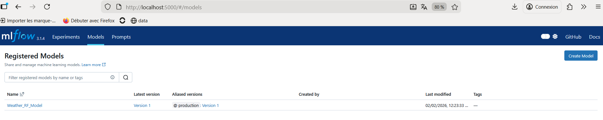
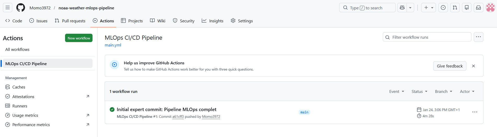
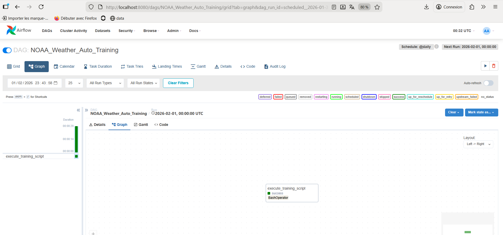
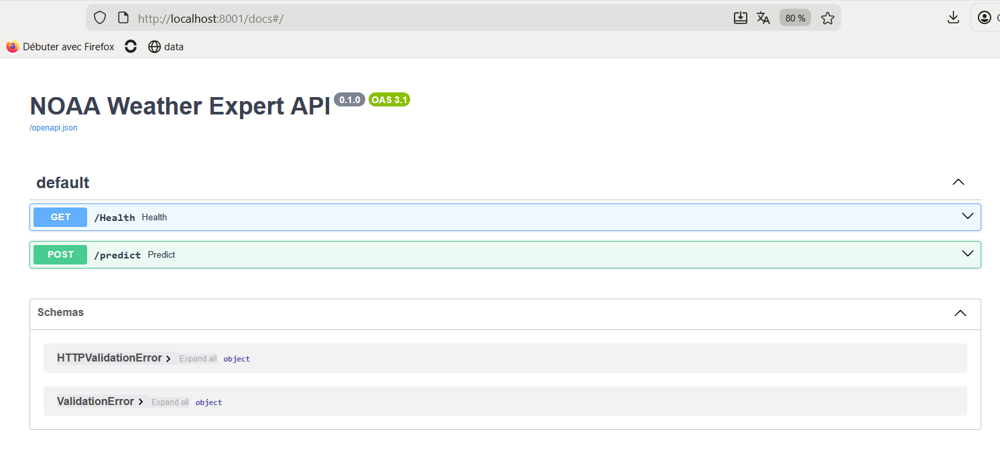
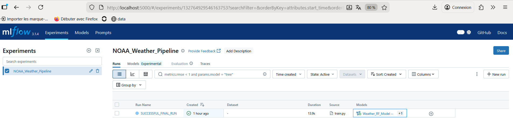
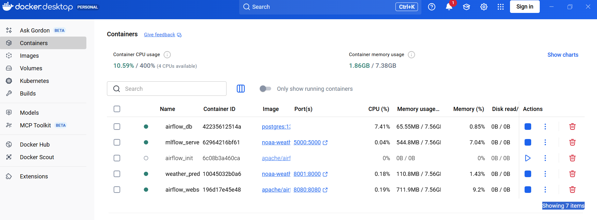

# NOAA Weather - Industrial End-to-End MLOps Pipeline

This documentation is also available in French: [README_FR.md](README_FR.md)


## Overview

This project implements a production-grade, end-to-end MLOps pipeline for temperature forecasting using NOAA weather data.  
It covers the entire machine learning lifecycle, from automated data ingestion and supervised training to model registry governance, API deployment, CI/CD, and continuous data drift monitoring.

The stack is fully containerized, orchestrated, and designed to reflect real-world industrial MLOps standards.

---

## Objectives and Business Value

This project demonstrates how to build a robust, scalable, and observable ML system :

- Full Automation - From raw NOAA ingestion to model promotion and serving
- Model Governance - Experiment tracking and lifecycle management via MLflow Model Registry
- Observability - Continuous monitoring of data drift using EvidentlyAI
- Production Readiness - CI/CD, testing, Dockerization, and reproducibility
- Operational Orchestration - Scheduled retraining and workflows via Apache Airflow

---

## Repository Structure

```text
noaa-weather-mlops-pipeline/
├── .github/workflows/   # CI/CD pipelines (tests, linting, Docker push)
├── airflow/             # Airflow configuration and DAGs
├── app/                 # FastAPI service and service-level Dockerfile
├── data/                # NOAA source data (raw_weather.csv)
├── docs/
│   └── assets/          # Screenshots and execution evidence
├── mlruns/              # MLflow local backend (experiments & artifacts)
├── monitoring/          # EvidentlyAI drift reports
├── src/                 # Core pipeline scripts (ingestion, training, promotion, monitoring)
├── tests/               # Unit tests and API smoke tests
├── .gitignore           # Git ignore rules (env, artifacts, local files)
├── docker-compose.yml   # Multi-container stack orchestration
├── requirements.txt     # Python dependencies
├── README.md            # Main documentation (English)
└── README_FR.md         # French documentation
```

---

## Technical Components

### 1. Data Ingestion and Preparation (`src/ingestion.py`)

- Automated NOAA data retrieval
- Missing value handling
- Feature engineering and dataset validation

### 2. Training et Experiment Tracking (`src/train.py`)

- Random Forest regression model
- Hyperparameters, metrics (MSE), and artifacts logged to MLflow

### 3. Automated Model Promotion (`src/promote.py`)

- Uses `MlflowClient` to identify the latest validated model
- Automatically assigns the `@production` alias in the MLflow Model Registry

### 4. Prediction API (`app/main.py`)

- FastAPI service loading the Production model dynamically
- `/predict` endpoint for inference
- `/health` endpoint for service health checks

### 5. Data Drift Monitoring (`src/monitoring.py`)

- EvidentlyAI used to compare inference data vs reference dataset
- Automated generation of drift reports and metrics

---

## Figures et Execution Evidence

All screenshots below are available in `docs/assets/` and rendered directly on GitHub

### MLflow Model Registry - Production Model


### CI/CD Pipeline - GitHub Actions Success


### Airflow - Scheduled Retraining DAG


### FastAPI - Interactive Swagger Documentation


### MLflow - Experiment Runs et Metrics


### Docker - Multi-Container Stack Running


---

## Quick Start

### 1. Permissions Initialization (WSL / Linux)

```bash
docker-compose down
sudo rm -rf mlruns/ && mkdir -p mlruns/artifacts
chmod -R 777 mlruns/
```

### 2. Launch the Stack

```bash
docker-compose up -d --build
```

### 3. Service URLs

- **FastAPI Swagger**: http://localhost:8001/docs
- **MLflow UI**: http://localhost:5000
- **Airflow UI**: http://localhost:8080  
  - Login: `admin / admin`

---

## Testing and CI/CD

- Unit tests and API smoke tests executed on each push
- Dockerfile linting (Hadolint)
- Automated Docker image build and push
- Pipeline enforced via GitHub Actions

---

## Key MLOps Concepts Demonstrated

- Reproducible experiments
- Model versioning & promotion
- Pipeline orchestration
- Model serving best practices
- Monitoring & drift detection
- Infrastructure as code

---

## Author

**Mohamed Lamine OULD BOUYA**  
Data Engineering - MLOps - Machine Learning
